| English | [中文](README.zh-CN.md) |

# AI Productivity Tool
Free and open-source, enhancing user productivity while ensuring privacy and data security. It provides efficient and convenient AI solutions, including but not limited to: built-in exclusive ChatGPT, one-click batch intelligent processing of images and videos, and more.

## Key Features
- **Free and Open-Source**: Free to use, with open-source code that users can review and modify themselves.
- **Privacy Protection**: Local deployment ensures all data is processed locally, guaranteeing user privacy and data security.
- **Offline Use**: Can operate offline, eliminating the need for internet access and avoiding network limitations.
- **No Installation Needed**: No installation or configuration required, just extract and run with a single click, making it quick and convenient.
- **Multi-language Support**: Supports multiple languages to meet the needs of users worldwide.

## Integrated AI Models
Integrates various latest AI models that can be used in a local offline environment, including built-in exclusive ChatGPT, one-click batch intelligent processing of images and videos, and more.

### ChatGPT
- Provides a locally offline ChatGPT model for enjoying intelligent AI conversations anytime, anywhere.

### Image Processing
- **Super-Resolution**: Enhances image resolution without compromising quality.
- **Auto Wipe**: Removes watermarks, subtitles, and logos from images, restoring the original picture.
- **Cartoon and Comic Conversion**: Converts images to vibrant cartoon or comic styles.
- **3D Conversion**: Converts images to realistic 3D scenes.
- **Color Restoration**: Recolors old photos, giving them a new life.
- **Face Restoration**: Repairs blurry or damaged face images, enhancing details.

### Video Processing
- **Super-Resolution**: Enhances video resolution while maintaining clear quality.
- **Auto Wipe**: Removes watermarks, subtitles, and logos from videos, restoring the original footage.
- **Cartoon and Comic Conversion**: Converts videos to fun cartoon or comic styles.
- **3D Conversion**: Converts videos to immersive 3D effects.
- **Color Restoration**: Recolors old videos, providing a new visual experience.
- **Frame Interpolation**: Increases video frame rate for smoother playback.
- **Video Organization**: Decrypts, synthesizes, and organizes downloaded and cached video files.

### Future Plans
Continue to integrate and optimize more AI models to meet diverse user needs.

### Open-Source and Download Links
- | [Github](https://github.com/rnchg/Apt/releases/latest) | [Gitee](https://gitee.com/rnchg/apt/releases/latest) | [Google Drive](https://drive.google.com/drive/folders/1o-SxxA2oAKjQkh-X83TN_zHjHIvOBe0V?usp=sharing) | [Baidu Cloud](https://pan.baidu.com/s/1I_DwtX15492z6B6ZHDhJ-Q?pwd=1234) | [Tencent Weiyun](https://share.weiyun.com/vGiBjW8d) |
- **Full Version**: Includes all features.
- **Lite Version**: Includes all features except ChatGPT.

### User Guide and Technical Support
- **Email**: [Rnchg@Hotmail.com](mailto:Rnchg@Hotmail.com)
- **Github**: [github.com/rnchg/Apt](https://github.com/rnchg/Apt)
- **Gitee**: [gitee.com/rnchg/apt](https://gitee.com/rnchg/apt)
- **YouTube**: [Light Cloud Wind](https://www.youtube.com/channel/UCHKH3bLpd8giPyr6x5sKGfw)
- **Bilibili**: [风轻云也净](https://space.bilibili.com/478375442)
- **QQ**: 6085398

### User Interface
Home

Settings
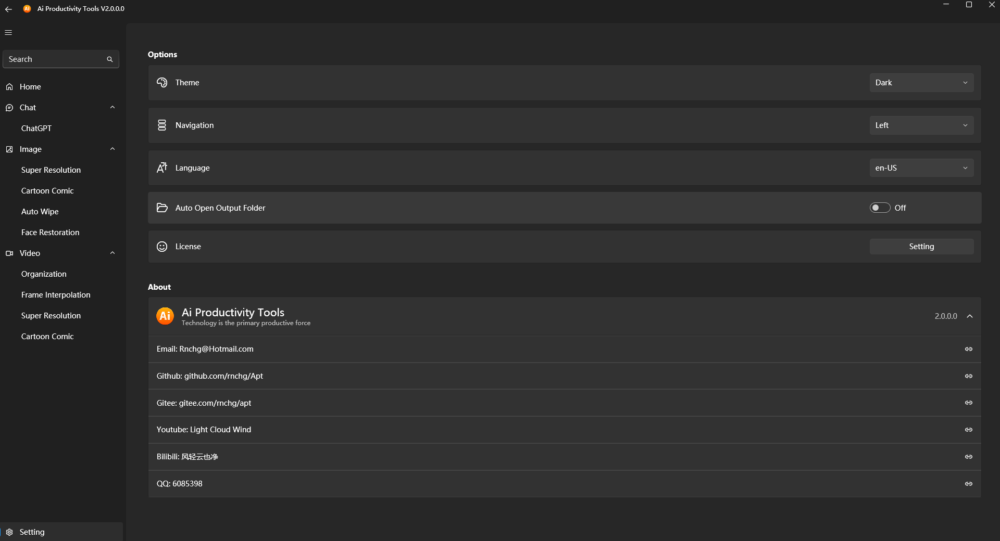
ChatGPT
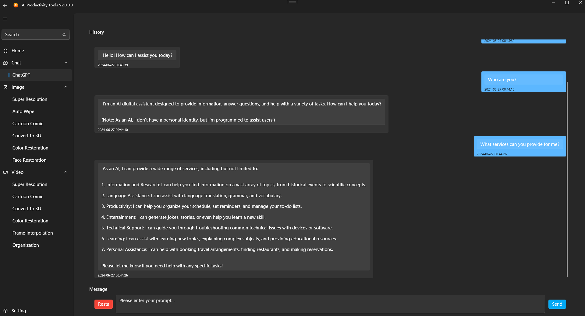
Image Super Resolution
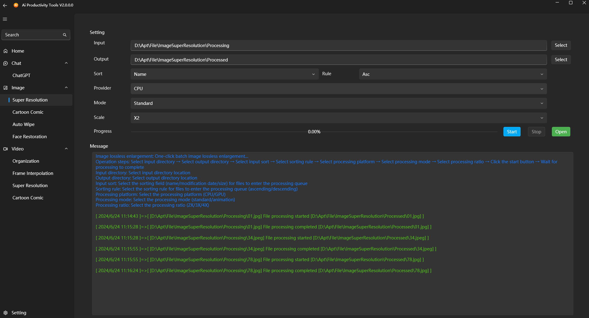
Image Auto Wipe
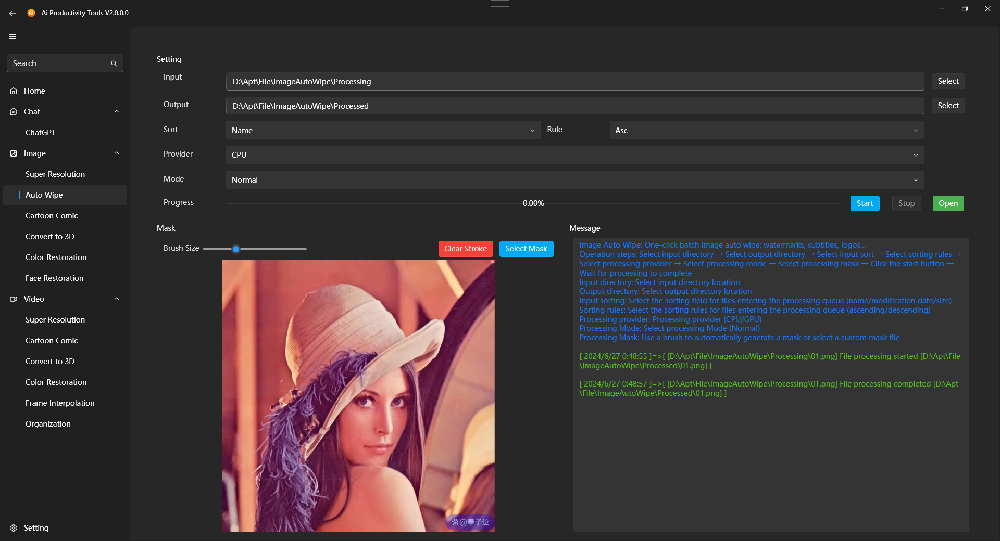
Image Cartoon Comic
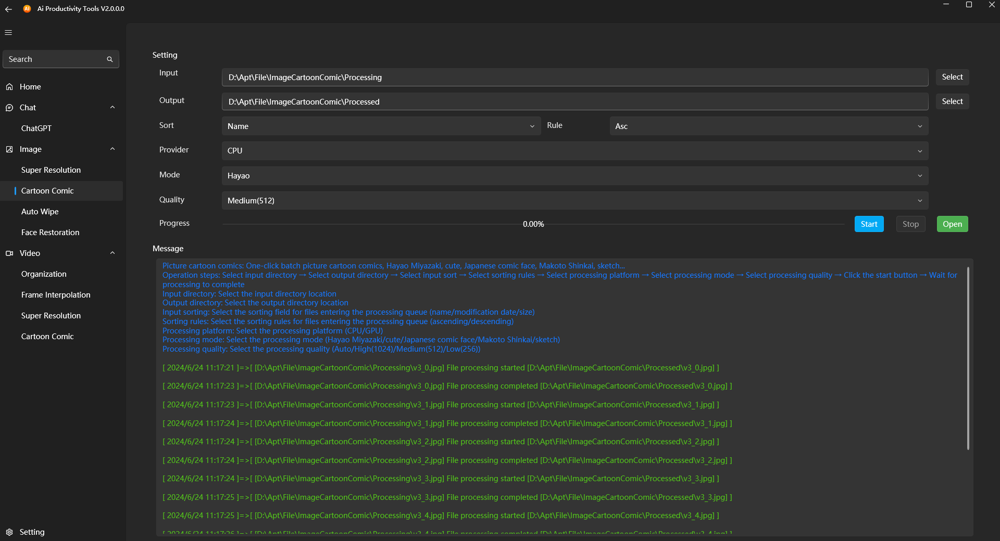
Image 3D Conversion
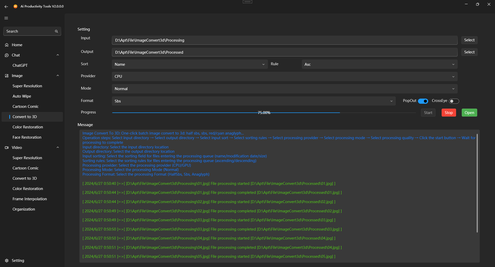
Image Color Restoration
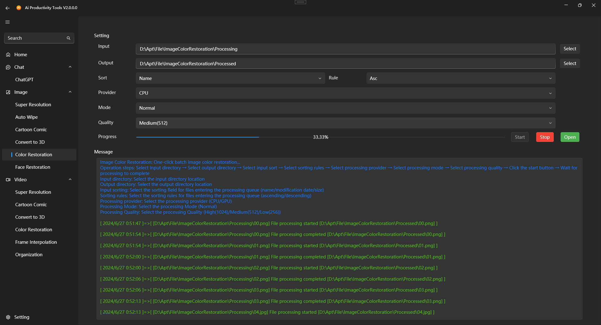
Image Face Restoration
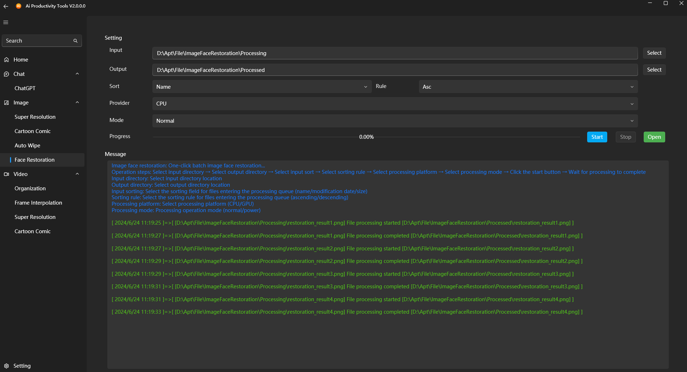
Video Super Resolution
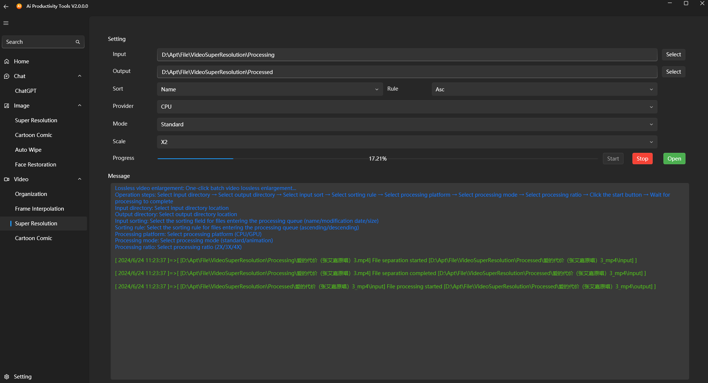
Video Cartoon Comic
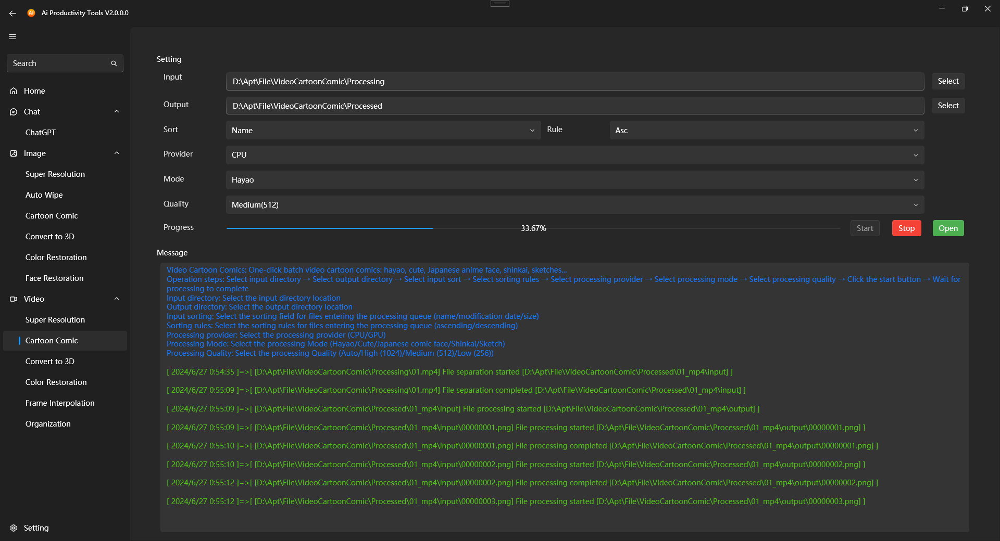
Video 3D Conversion
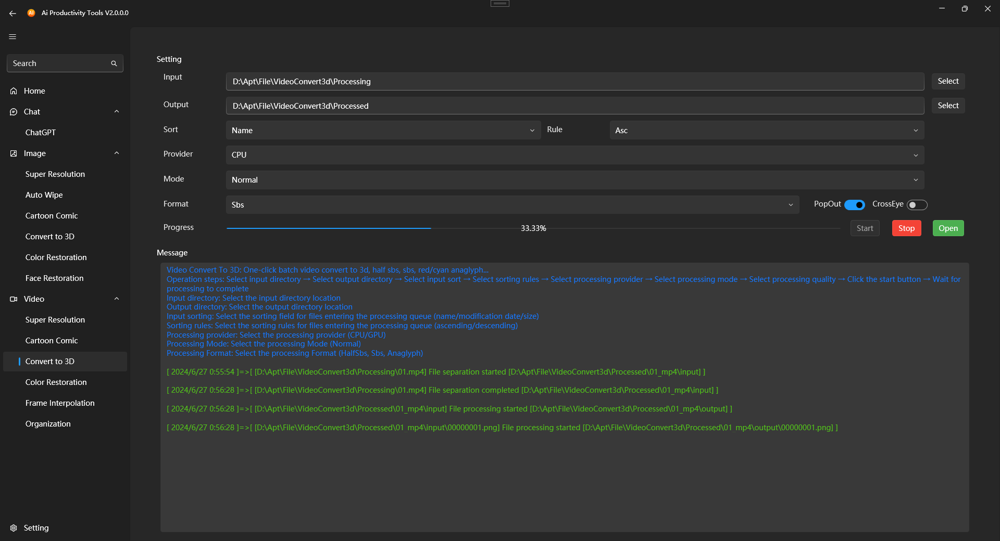
Video Color Restoration
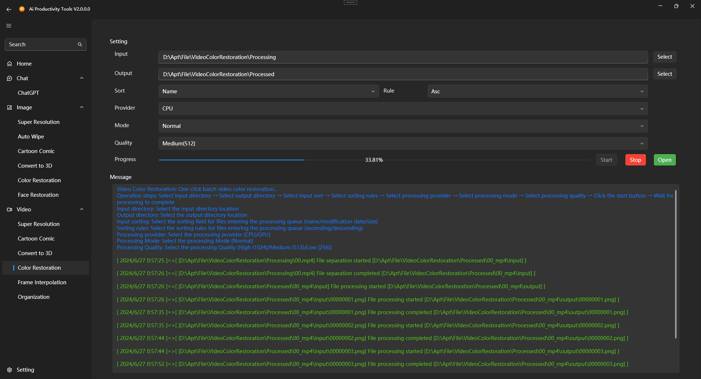
Video Frame Interpolation
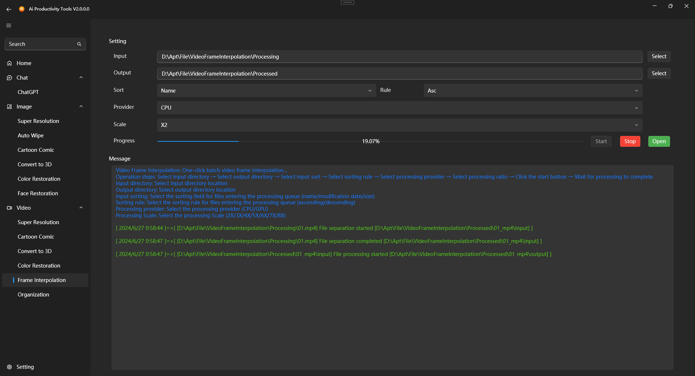
Video Organization
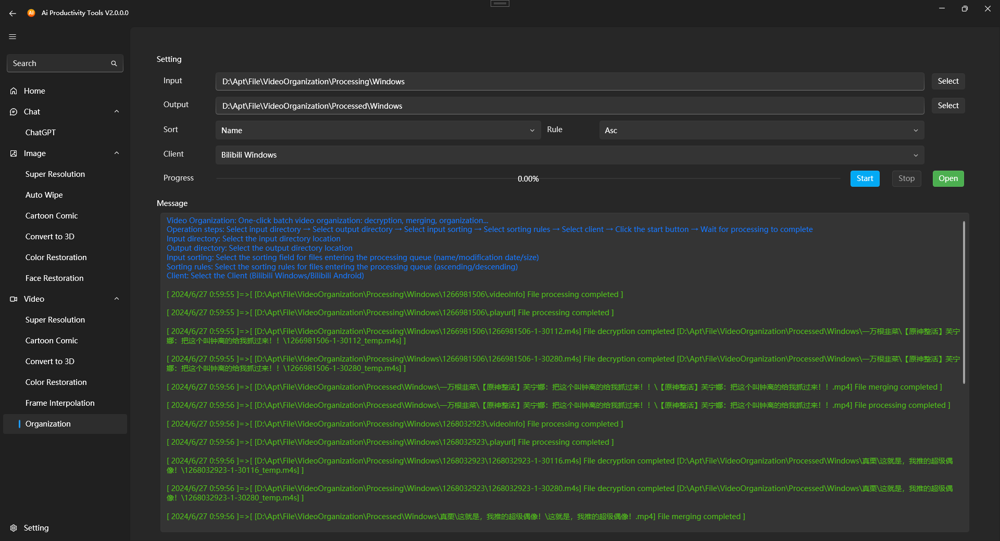

### Donation Support
If you find this project useful, you can buy the author a cup of coffee.
