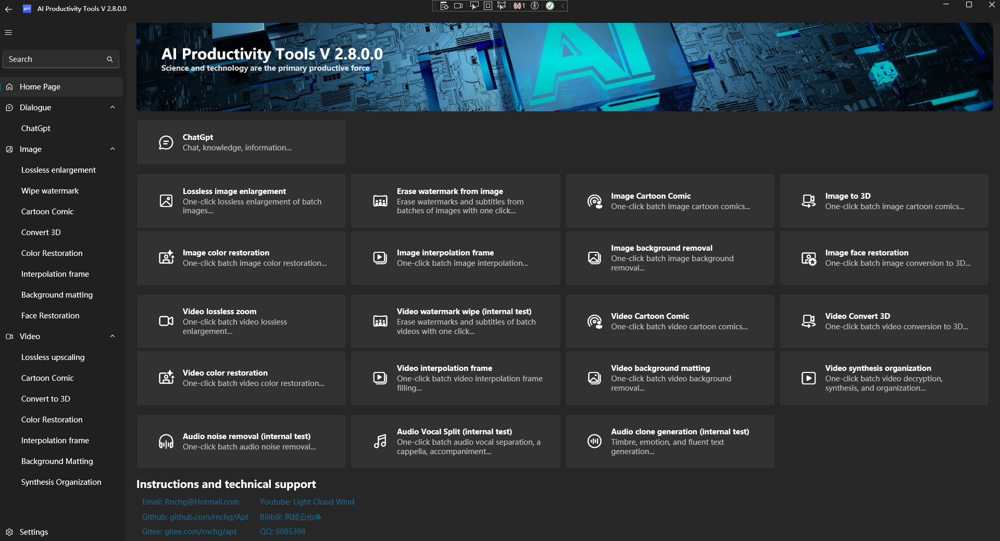
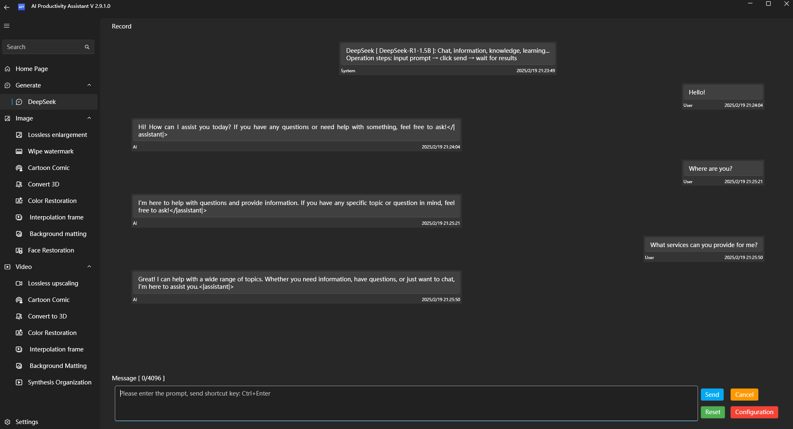
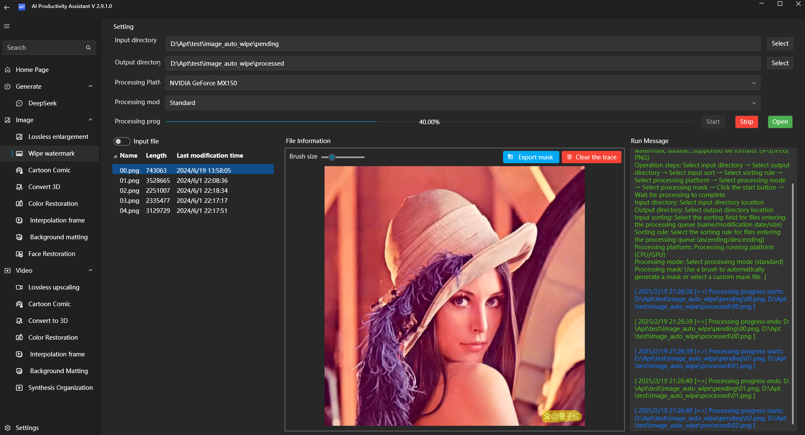
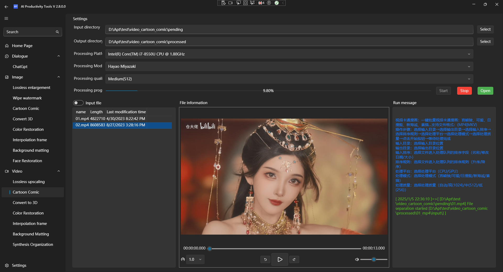
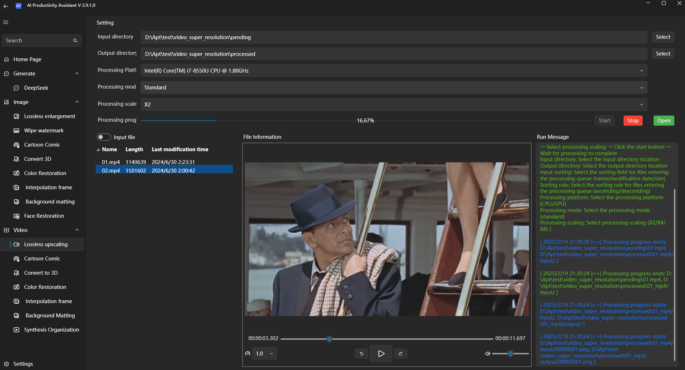
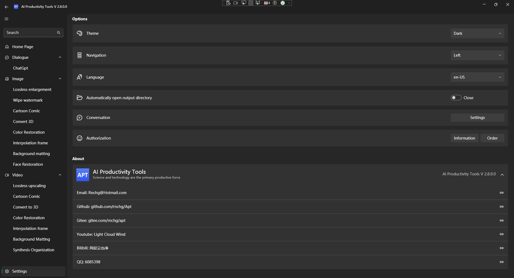

| English | [中文](README.zh-CN.md) |

# AI Productivity Tools
Free and open source, improve user productivity, and protect privacy and data security. Provide efficient and convenient AI solutions, including but not limited to: built-in local exclusive ChatGPT, Phi, DeepSeek, one-click batch intelligent processing of images, videos, audio, etc.

## Main Features
- **Free and open source**: free to use, open source code, users can view and modify it by themselves.
- **Privacy protection**: local deployment, all data is processed locally to ensure user privacy and data security.
- **Offline use**: no need to connect to the Internet, can run offline, avoid the impact of network restrictions.
- **No installation and configuration**: no installation and configuration, unzip and start running with one click, convenient and fast.
- **Multi-language support**: support multi-language internationalization to meet the needs of global users.

## Integrated AI model
Integrated with a variety of latest AI models, you can use the built-in exclusive ChatGPT, Phi, DeepSeek in the local offline environment, one-click batch intelligent processing of images, videos, audio, etc.

### Dialogue
- **Phi**: Provides a local offline Phi model, allowing you to enjoy the intelligent AI dialogue experience anytime, anywhere.
- **DeepSeek**: Provides a local offline DeepSeek model, allowing you to enjoy the intelligent AI dialogue experience anytime, anywhere.

### Image Processing
- **Image Lossless Zoom**: Improves image resolution to ensure lossless image quality.
- **Image Watermark Erase**: Erase watermarks, subtitles, and logos from images to restore the original image.
- **Image Cartoon Comics**: Convert images to vivid cartoon or comic styles.
- **Image 3D Conversion**: Convert images to realistic 3D scenes.
- **Image Coloring and Restoration**: Recolor old photos and give them a new lease of life.
- **Image Interpolation and Frame Infill**: Automatically generate frame infill images for images.
- **Image Background Removal**: Easily remove the background of an image and export a transparent background image.
- **Image Face Repair**: Repair blurred or damaged face images and enhance details.

### Video Processing
- **Lossless Video Zoom**: Increase video resolution and keep the image clear.
- **Erase watermark from video (under testing)**: Erase watermarks, subtitles, and logos from videos and restore the original image.
- **Cartoon from video**: Convert videos to fun cartoon or comic styles.
- **Convert video to 3D**: Convert videos to immersive 3D effects.
- **Colorize and repair video**: Recolor old videos and experience new visual effects.
- **Interpolate and fill frames from video**: Increase video frame rate for smoother playback.
- **Background removal from video**: Easily remove video backgrounds and replace backgrounds.
- **Video synthesis and organization**: Decrypt, synthesize, and organize downloaded cached video files.

### Audio Processing
- **Voice separation from audio (under testing)**: Accurately separate the voice and accompaniment in the audio and restore the original accompaniment, voice, etc.
- **Audio cloning generation (under testing)**: Generates cloned voices based on text content, accurately restoring timbre, emotion, and speech speed.
- **Audio to text generation (under testing)**: Intelligent real-time analysis of speech, automatic generation of text content.
- **Audio noise removal (under testing)**: Intelligently identifies and removes interference noise in audio, restoring clear original sound.

### Supported platforms
|Operating system|Status|Notes|
|---|---|---|
|Windows|Released|Windows 10 x64 1709+|
|Android|Under development||
|iOS|Under development||
|Mac|Planning||
|Linux|Planning||

### Future plans
We will continue to integrate and optimize more AI models to meet the diverse needs of users.

### Open source and download address
- | [Github](https://github.com/rnchg/Apt/releases/latest) | [Gitee](https://gitee.com/rnchg/apt/releases/latest) | [Google Drive](https://drive.google.com/drive/folders/1o-SxxA2oAKjQkh-X83TN_zHjHIvOBe0V?usp=sharing) | [Baidu Drive](https://pan.baidu.com/s/1I_DwtX15492z6B6ZHDhJ-Q?pwd=1234) | [Tencent Weiyun](https://share.weiyun.com/vGiBjW8d) |
- **Full version**: includes all functions.
- **Lite version**: includes all functions except [ChatGPT, Phi, DeepSeek].

### Instructions and technical support
- **Email**: [Rnchg@Hotmail.com](mailto:Rnchg@Hotmail.com)
- **Github**: [github.com/rnchg/Apt](https://github.com/rnchg/Apt)
- **Gitee**: [gitee.com/rnchg/apt](https://gitee.com/rnchg/apt)
- **Youtube**: [Light Cloud Wind](https://www.youtube.com/channel/UCHKH3bLpd8giPyr6x5sKGfw)
- **Bilibili**: [风轻云也净](https://space.bilibili.com/478375442)
- **QQ**: 6085398

### Running interface
Home

ChatGPT

Image processing

Video processing

Video processing

Settings

### Donation support
If you find this project useful, you can buy the author a cup of coffee.
