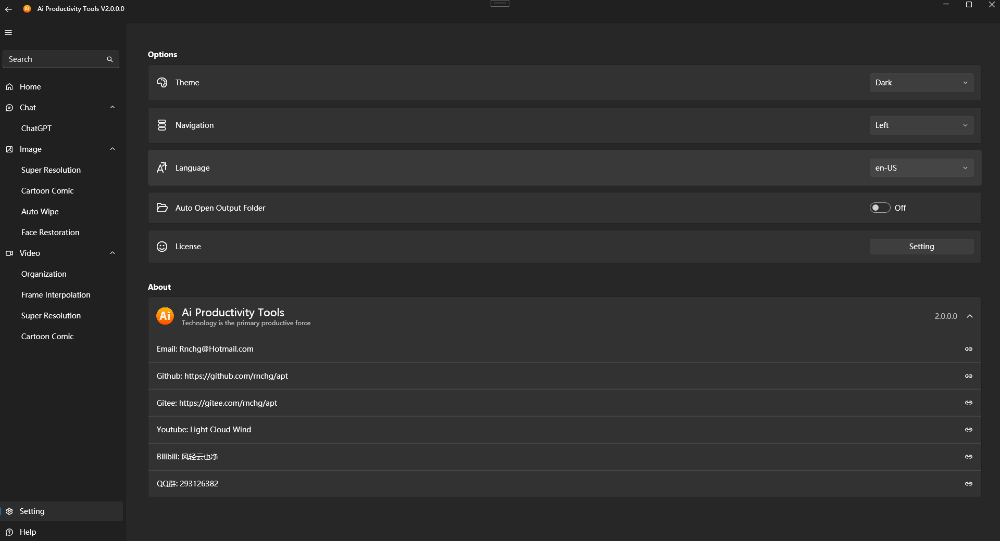
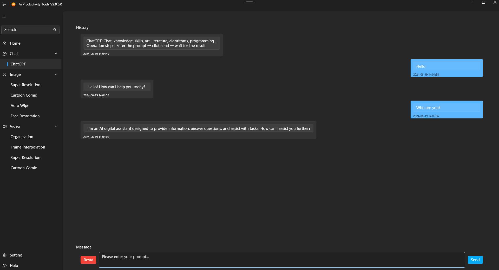
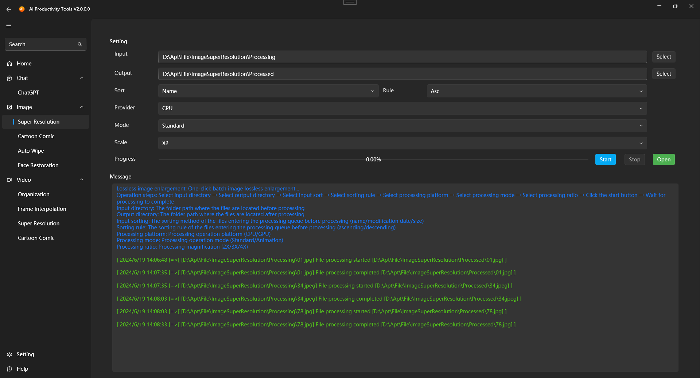
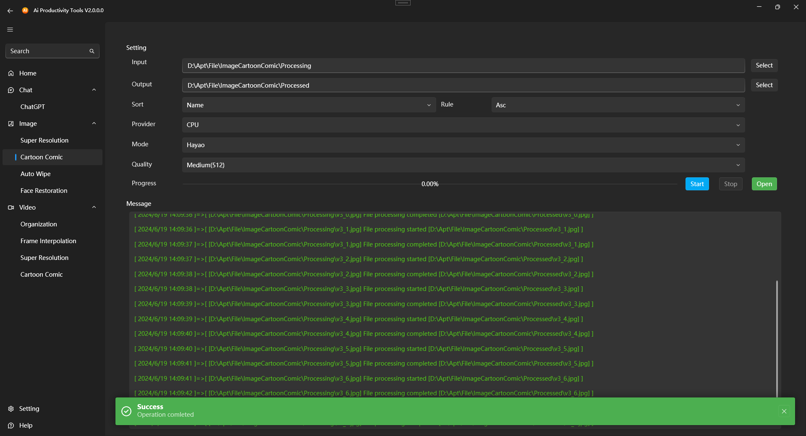

| English | [Chinese](README.zh-CN.md) |

# AI Productivity Tool

Free and open-source, aimed at improving user productivity while ensuring privacy and data security. Provides efficient and convenient AI solutions for enhancing image and video processing experiences and efficiency.

## Key Features

- **Free and Open-Source**: Free to use, open-source code available for user review and modification.
- **Privacy Protection**: Local deployment ensures all data is processed locally, guaranteeing user privacy and data security.
- **Offline Use**: Operates offline without needing an internet connection, avoiding network restrictions.
- **No Installation Required**: No installation needed; simply extract and run with a single click, easy and quick to use.
- **Multi-Language Support**: Supports internationalization to meet the needs of global users.

## Integrated AI Models

Integrates multiple AI models, enabling users to conduct ChatGPT conversations and efficiently batch process images and videos offline locally.

### ChatGPT
- Supports local operation of ChatGPT models, allowing users to have intelligent conversations anytime.

### Image Processing
- **Image Super-Resolution**: Enhances image resolution without losing quality.
- **Image Cartoon Comic**: Converts images into cartoon or comic styles.
- **Image Watermark Removal**: Removes watermarks from images, restoring the original image.
- **Image Face Restoration**: Repairs blurred or damaged facial images, enhancing facial details.

### Video Processing
- **Video Merging**: Organizes and merges multiple video files into one.
- **Video Frame Interpolation**: Increases video frame rate for smoother playback.
- **Video Super-Resolution**: Enhances video resolution without losing quality.
- **Video Cartoon Comic**: Converts videos into cartoon or comic styles.
- **Video Watermark Removal**: Removes watermarks from videos, restoring the original footage.

### Future Plans
Will continue to integrate and update more AI functional modules to meet diverse user needs.

### Download Links
- | [Github](https://github.com/rnchg/Apt/releases/latest) | [Gitee](https://gitee.com/rnchg/apt/releases/latest) | [OneDrive](https://1drv.ms/f/c/15624ff2496d1e5b/Es9JrjwhI-VAh_nr-bOZDa4BnDgox1S-huJFOmpS-nKC7g?e=MULiHJ) | [Google Drive](https://drive.google.com/drive/folders/1o-SxxA2oAKjQkh-X83TN_zHjHIvOBe0V?usp=sharing) | [Baidu Drive](https://pan.baidu.com/s/1I_DwtX15492z6B6ZHDhJ-Q?pwd=1234) |
- **Full version**: includes all functions.
- **Lite version**: includes all functions except 【ChatGPT】.

### Run interface
Home

Settings

ChatGPT Conversation

Image Super-Resolution

Image Watermark Removal

Image Cartoon Comic

### Technical Support
- **Email**: [Rnchg@Hotmail.com](mailto:Rnchg@Hotmail.com)
- **Github**: [github.com/rnchg/Apt](https://github.com/rnchg/Apt)
- **Gitee**: [gitee.com/rnchg/apt](https://gitee.com/rnchg/apt)
- **YouTube**: [Light Cloud Wind](https://www.youtube.com/channel/UC1kFNUUyXzN2TJ2L1oS0amg)
- **Bilibili**: [风轻云也净](https://space.bilibili.com/478375442)
- **QQ**: 6085398

### Donation Support
If you found this project useful, feel free to buy the author a cup of coffee.

