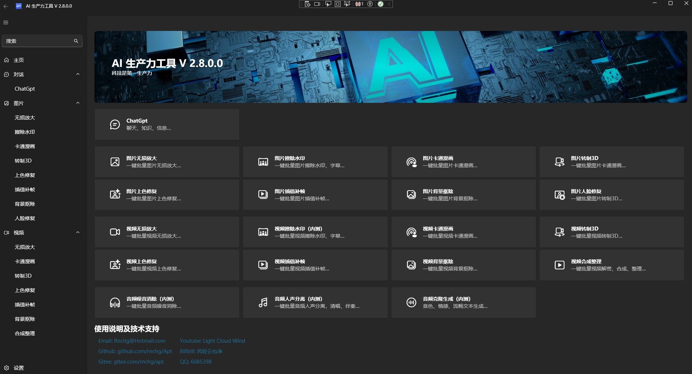
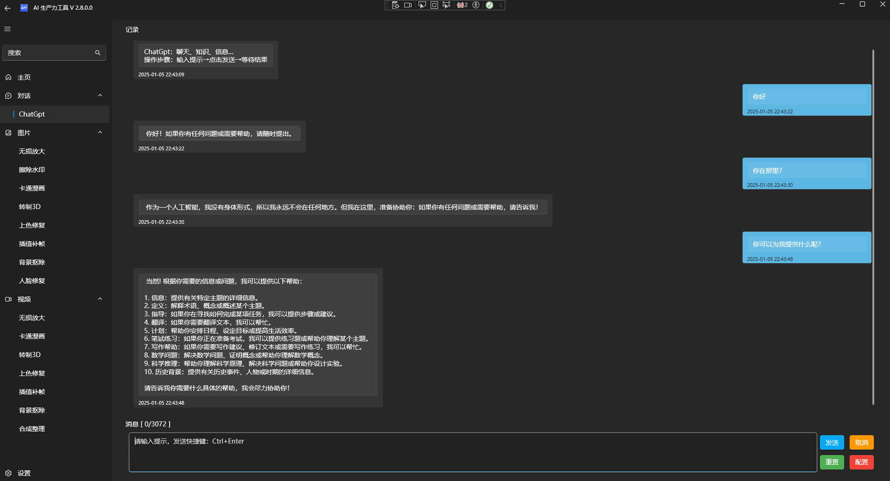
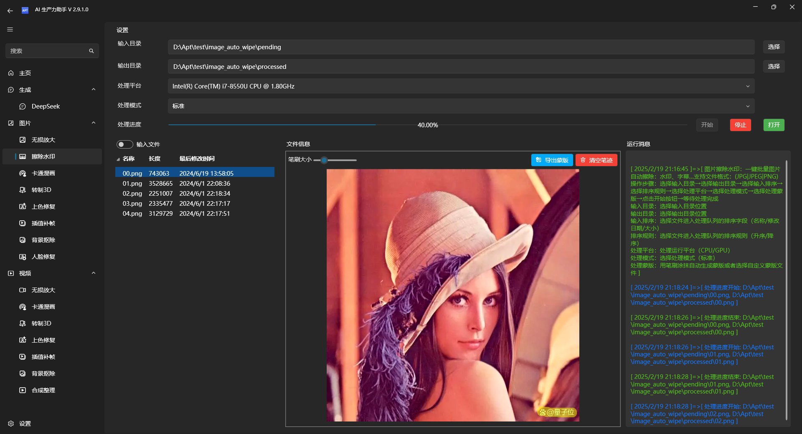
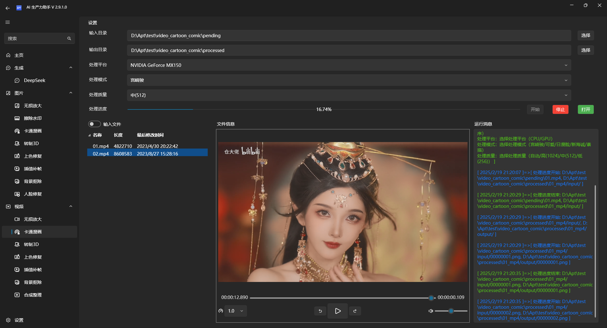
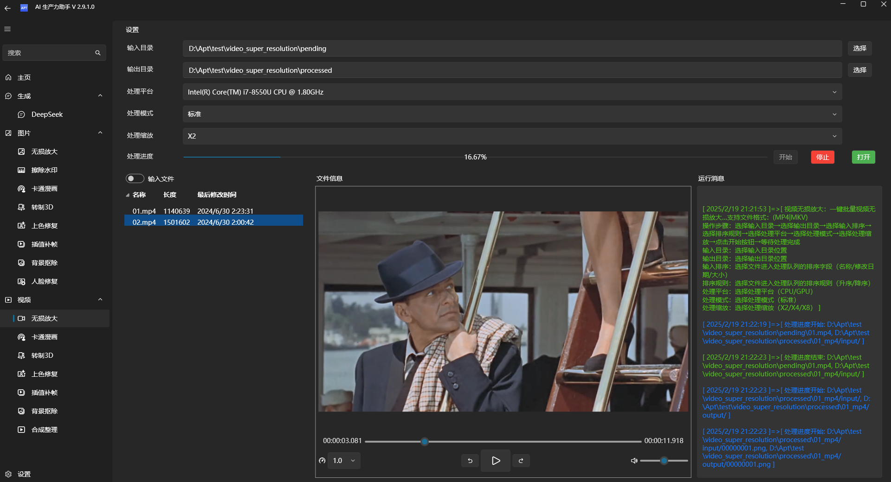
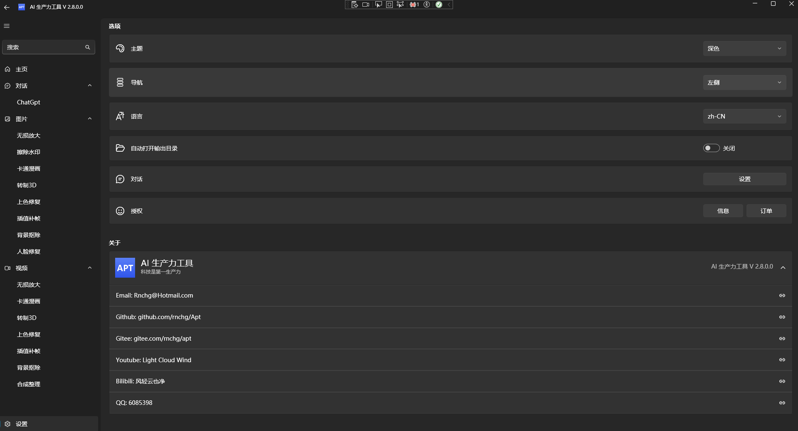

| [English](README.en-US.md) | 中文 |

# AI 生产力工具

免费开源，提升用户生产力，保障隐私和数据安全。提供高效便捷的 AI 解决方案，包括但不限于：内置本地专属 ChatGPT、DeepSeek、Phi、Qwen 等模型，一键批量智能处理图片、视频、音频等。

## 主要特点

- **免费开源**：免费使用，源代码开放，用户可以自行查阅和修改。
- **隐私保障**：本地部署，所有数据在本地处理，确保用户隐私和数据安全。
- **离线使用**：无需联网，离线即可运行，避免网络受限的影响。
- **免安装配置**：无需安装配置，解压即可一键启动运行，方便快捷。
- **多语言支持**：支持多语言国际化，满足全球用户需求。

### 生成对话

- **生成对话**：提供本地离线运行的 ChatGPT、DeepSeek、Phi、Qwen 等模型，随时随地畅享智能 AI 对话体验。

### 图片处理

- **图片无损放大**：提升图片分辨率，确保画质无损。
- **图片擦除水印**：擦除图片中的水印、字幕、Logo，恢复原始画面。
- **图片卡通漫画**：将图片转换为生动的卡通或漫画风格。
- **图片转制 3D**：将图片转换为逼真的 3D 场景。
- **图片上色修复**：为老旧照片重新着色，焕发新生。
- **图片插值补帧**：为图片自动生成补帧图片。
- **图片背景抠除**：轻松抠除图片背景，导出透明背景图片。
- **图片人脸修复**：修复模糊或受损的人脸图片，增强细节。

### 视频处理

- **视频无损放大**：提高视频分辨率，保持画质清晰。
- **视频擦除水印**：擦除视频中的水印、字幕、Logo，恢复原始画面。
- **视频卡通漫画**：将视频转换为有趣的卡通或漫画风格。
- **视频转制 3D**：将视频转换为身临其境的 3D 效果。
- **视频上色修复**：为老旧视频重新着色，体验全新视觉效果。
- **视频插值补帧**：提高视频帧率，播放更流畅。
- **视频背景抠除**：轻松抠除视频背景，便捷替换背景。
- **视频合成整理**：将下载缓存的视频文件解密、合成、整理。

### 音频处理

- **音频人声分离**：将音频中的人声和伴奏精准分离，恢复原始伴奏、人声等。
- **音频噪音消除**：智能识别并清除音频中的干扰噪声，复原清晰原始声音。
- **音频文字转语音（测试中）**：根据文本内容自成生成克隆声音，准确还原音色、情感、语速。
- **音频语音转文字（测试中）**：智能实时分析语音，自动生成文本内容。

### 支持平台

| 操作系统 | 状态   | 备注                 |
| -------- | ------ | -------------------- |
| Windows  | 已发布 | Windows 10 x64 1803+ |
| Android  | 开发中 |                      |
| iOS      | 开发中 |                      |
| Mac      | 计划中 |                      |
| Linux    | 计划中 |                      |

### 未来计划

将继续集成优化更多 AI 模型，以满足用户的多样化需求。

### 开源及下载地址

- | [Github](https://github.com/rnchg/Apt/releases/latest) | [Gitee](https://gitee.com/rnchg/apt/releases/latest) | [谷歌云盘](https://drive.google.com/drive/folders/1o-SxxA2oAKjQkh-X83TN_zHjHIvOBe0V?usp=sharing) | [百度云盘](https://pan.baidu.com/s/1I_DwtX15492z6B6ZHDhJ-Q?pwd=1234) | [腾讯微云](https://share.weiyun.com/vGiBjW8d) |

### 使用说明及技术支持

- **Email**：[Rnchg@Hotmail.com](mailto:Rnchg@Hotmail.com)
- **Github**：[github.com/rnchg/Apt](https://github.com/rnchg/Apt)
- **Gitee**：[gitee.com/rnchg/apt](https://gitee.com/rnchg/apt)
- **Youtube**：[Light Cloud Wind](https://www.youtube.com/channel/UCHKH3bLpd8giPyr6x5sKGfw)
- **Bilibili**：[风轻云也净](https://space.bilibili.com/478375442)
- **QQ**：6085398

### 运行界面

主页

生成对话

图片处理

视频处理

视频处理

设置

### 捐赠支持

如果您觉得这个项目有用，可以请作者喝一杯咖啡。

