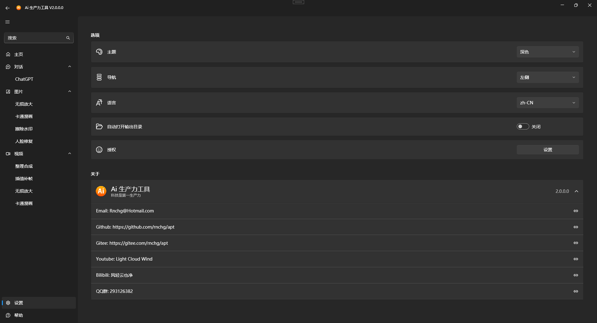
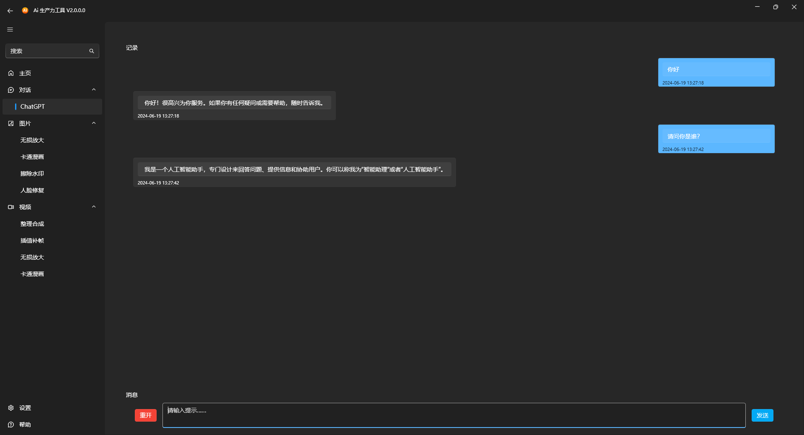
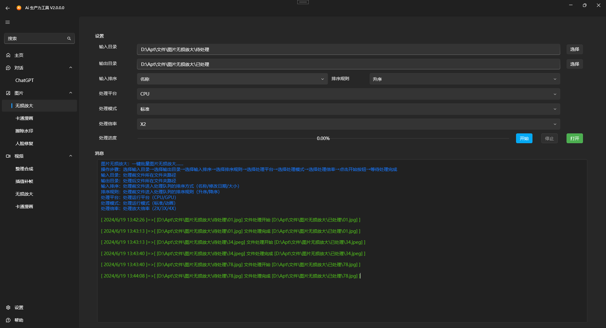
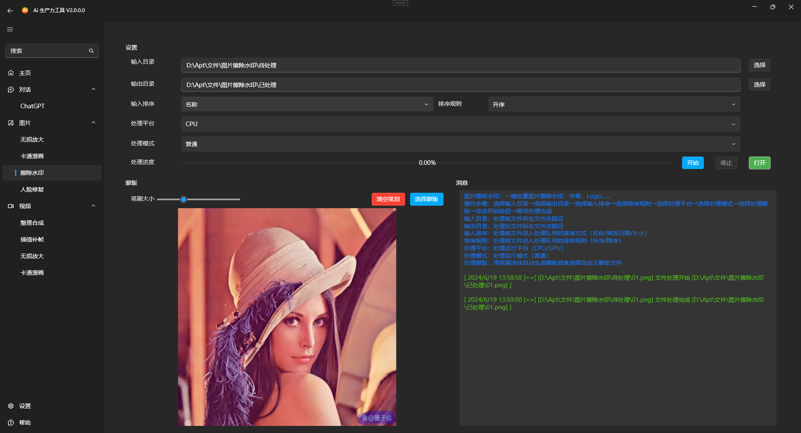
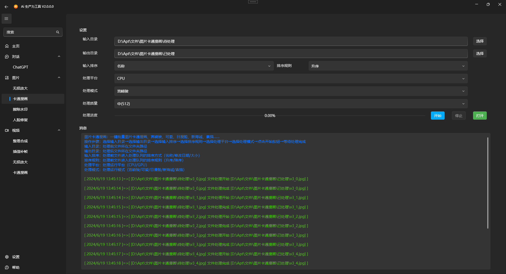

| 中文 | [英文](README.en-US.md) | 

# AI 生产力工具

免费开源，旨在提高用户的生产力，同时保障用户的隐私和数据安全。为用户提供高效、便捷的AI解决方案，提升图片和视频处理的体验和效率。

## 主要特点

- **免费开源**：免费使用，源代码开放，用户可以自行查阅和修改。
- **隐私保障**：本地部署，所有数据在本地处理，确保用户隐私和数据安全。
- **离线使用**：无需联网，离线即可运行，免受网络受限的影响。
- **免安装**：无需安装，解压后即可一键启动运行，方便快捷。
- **多语言支持**：支持多语言国际化，满足全球用户需求。

## 集成AI模型

集成了多种AI模型，用户可以本地离线进行ChatGPT对话及一键批量高效处理图片和视频。

### ChatGPT对话
- 支持本地运行ChatGPT模型，用户可以随时进行智能对话。

### 图片处理
- **图片无损放大**：提高图片分辨率且不损失画质。
- **图片卡通漫画**：将图片转换为卡通或漫画风格。
- **图片擦除水印**：去除图片中的水印，恢复原始画面。
- **图片人脸修复**：修复模糊或损坏的人脸图片，提升人脸细节。

### 视频处理
- **视频整理合并**：将多个视频文件整理并合并为一个文件。
- **视频插值补帧**：提升视频帧率，使视频播放更流畅。
- **视频无损放大**：提高视频分辨率且不损失画质。
- **视频卡通漫画**：将视频转换为卡通或漫画风格。
- **视频擦除水印**：去除视频中的水印，恢复原始画面。

### 未来计划
将继续集成和更新更多的AI功能模块，以满足用户的多样化需求。

### 下载地址
- | [Github](https://github.com/rnchg/Apt/releases/latest) | [Gitee](https://gitee.com/rnchg/apt/releases/latest) | [OneDrive](https://1drv.ms/f/c/15624ff2496d1e5b/Es9JrjwhI-VAh_nr-bOZDa4BnDgox1S-huJFOmpS-nKC7g?e=MULiHJ) | [谷歌云盘](https://drive.google.com/drive/folders/1o-SxxA2oAKjQkh-X83TN_zHjHIvOBe0V?usp=sharing) | [百度云盘](https://pan.baidu.com/s/1I_DwtX15492z6B6ZHDhJ-Q?pwd=1234) |
- **完整版（Full）**：包含所有功能。
- **精简版（Lite）**：包含除【ChatGPT】之外的所有功能。
 
### 运行界面
主页

设置

ChatGPT

图片无损放大

图片擦除水印

图片卡通漫画

### 技术支持
- **Email**：[Rnchg@Hotmail.com](mailto:Rnchg@Hotmail.com)
- **Github**：[Apt](https://github.com/rnchg/Apt)
- **Gitee**：[Apt](https://gitee.com/rnchg/apt)
- **Youtube**：[Light Cloud Wind](https://www.youtube.com/channel/UC1kFNUUyXzN2TJ2L1oS0amg)
- **Bilibili**：[风轻云也净](https://space.bilibili.com/478375442)
- **QQ群**：293126382

### 捐赠支持
如果您觉得这个项目有用，可以请作者喝一杯咖啡。

